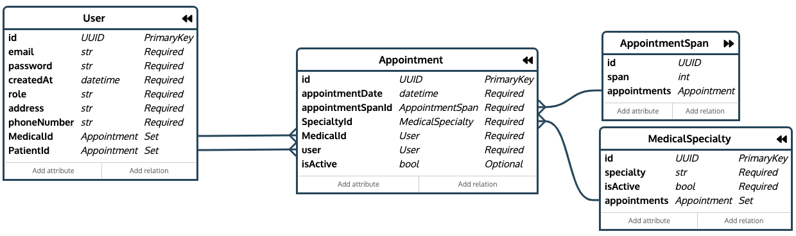

# Language / Idioma
- [English (UK)](#english-uk)
- [Português (BR)](#português-br)

# English (UK)

## Introduction
Substitute project (sub for Hackathon), Course: .Net System Architecture with Azure

## The Application:
### Medical Appointment Scheduling System.
#### https://raphaelcordon.com/

The website is entirely written in English to be used in my personal portfolio.

#### - Functional Requirements:
    - Patients should be able to create and manage personal accounts.
    - Patients should be able to schedule, reschedule, or cancel appointments.
    - Doctors should be able to view and manage their appointment schedules.
    - There should be a notification system to remind patients of their appointments. 
        - These notifications can be via email.
#### - Non-Functional Requirements:
    - The system should be developed using C# and .NET.
    - The user interface is at the discretion of the student.
    - The system should have a logical delete flow, not a physical delete.

## Technical Project
- BACKEND:
    - .Net Core 8;
    - Entity Framework;
    - SQL Server database (Tables generated and maintained by EF Migrations).
    - Applied software modeling concepts of DDD.
- Authentication and Access:
    - .Net Identity and JWT authentication.
    - Roles for access level control (authorization).
- Unit Tests:
    - Tests for Web Api Services.
- FRONTEND:
    - React-Vite;
    - Style: daisy-UI, Tailwind CSS, Fontawesome;
- Docker:
    - Docker-compose integrating containers for application and database;
    - In production, also integrates the implementation of NGINX on a virtual machine for reverse proxy management and caching.
- ORM:
    - 

## Environment
1.  Building implemented in GitHub pipeline (Actions) automatically publishing the application image on Docker Hub.

2.  Deployment on a virtual machine on Digital Ocean via docker-compose.deploy.yml which includes:
    - Creation of container for SQL server and application database.
    - Creation of container for application, Web Api, and Front End building.
    - Creation of container for Nginx to manage reverse proxy and web application caching.
    - _This stage consumes the secret keys from a GitHub keyvault for various accesses and configurations._

3.  Removal of old images and startup of containers.

## Features:
1.  Endpoints:
    - The following endpoints were implemented for USERS (doctors and patients), APPOINTMENTS, and MEDICAL SPECIALTIES.
        - Create, Update, Get, List, and logical delete.
    - The user registration and authentication endpoints are the only endpoints accessible without authorization.
    - Users must be registered with the roles "Doctor" or "Patient", otherwise they will not have access to the application.
    - The "admin" role does not have a practical application in this version due to time constraints.
2.  Email Sending:
    - The system sends an email reminding the patient about a scheduled appointment one day before the appointment date.

# Português (BR)

## Introdução
Projeto substitutivo (sub de Hackaton), Curso Arquitetura de sistemas .Net com Azure

## A aplicação:
### Sistema de Agendamento de Consultas Médicas.
#### https://raphaelcordon.com/

O site foi todo escrito em inglês a fim de ser utilizado em meu portfólio pessoal.

#### - Requisitos Funcionais:
    - Os(as) pacientes devem ser capazes de criar e gerenciar contas pessoais.
    - Os(as) pacientes devem ser capazes de agendar, reagendar ou cancelar consultas.
    - Os(as) médicos(as) devem ser capazes de visualizar e gerenciar suas agendas de consultas.
    - Deve haver um sistema de notificação para lembrar pacientes de suas consultas. 
        - Estas notificações podem ser via e-mail.
#### - Requisitos NÃO Funcionais:
    - O sistema deve ser desenvolvido utilizando C# e .NET.
    - A interface do usuário fica a critério do(a) estudante.
    - O sistema deve ter um fluxo de delete lógico, não físico.

## Projeto Técnico
- BACKEND:
    - .Net Core 8;
    - Entity Framework;
    - Banco de dados SQL Server (Tabelas geradas e mantidas por EF Migrations).
    - Aplicados conceitos da modelagem de software DDD.
- Autenticação e Acesso:
    - .Net Identity e autenticação por JWT.
    - Roles para controle de nível de acesso (autorização).
- Testes Unitários:
    - Testes para os Serviços da Web Api.
- FRONTEND:
    - React-Vite;
    - Estilo: daisy-UI, Tailwind CSS, Fontawesome;
- Docker:
    - Docker-compose integrando containers para aplicação e banco de dados;
    - Em produção, também integra a implementação do NGINX em máquina virtual para gerenciamento de proxy reverso e caching.
- ORM:
    - 

## O Ambiente
1.  Building implementado em pipeline do GitHub (Actions) publicando automaticamente a imagem da aplicação no Docker Hub.

2.  Publicação em máquina virtual na Digital Ocean via docker-compose.deploy.yml no qual ocorre:
    - Criação de container para servidor SQL e do banco de dados da aplicação.
    - Criação de container para aplicação, Web Api e construção do Front End.
    - Criação de container para Nginx gerenciar proxy reverso e caching das aplicações web.
    - _Essa etapa consome as secret keys de um keyvault no GitHub para acessos e configurações diversas._

3.  Remoção de imagens antigas e inicialização dos containers.

## Funcionalidades:
1.  Endpoints:
    - Foram implementados os seguintes endpoints para USUÁRIOS (médicos e pacientes), CONSULTAS e ESPECIALIDADES MÉDICAS.
        - Criar, Alterar, Obter, Listar e delete lógico.
    - Os endpoints de cadastro de usuários e autenticação são os únicos endpoints liberados para acesso sem autorização.
    - Os usuários devem ser cadastrados com as roles "Doctor" ou "Patient", caso contrário não terão acesso à aplicação.
    - A role "admin" não tem uma aplicação prática nesta versão por restrição de tempo.
2.  Envio de E-mail:
    - O sistema envia um e-mail lembrando ao paciente sobre uma consulta agendada um dia antes da data da consulta.
